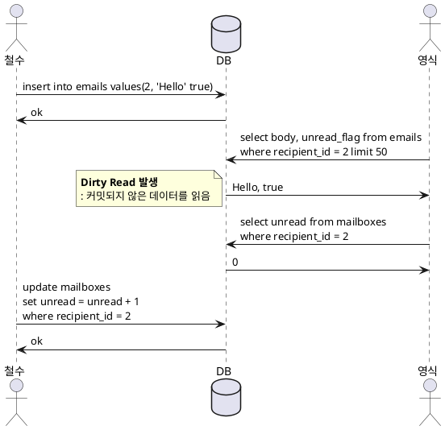
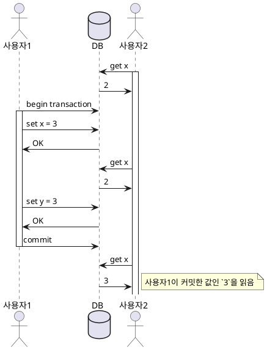
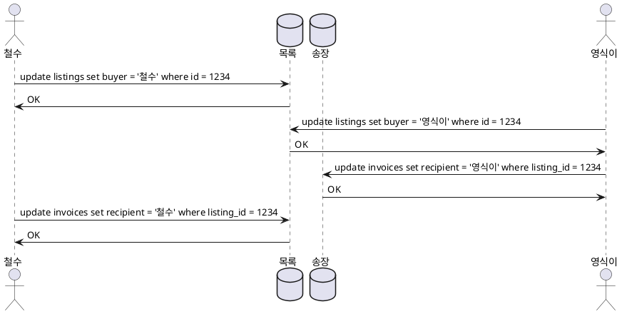
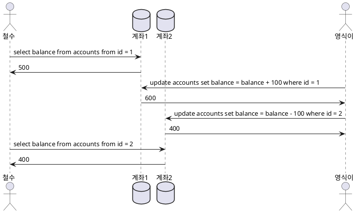
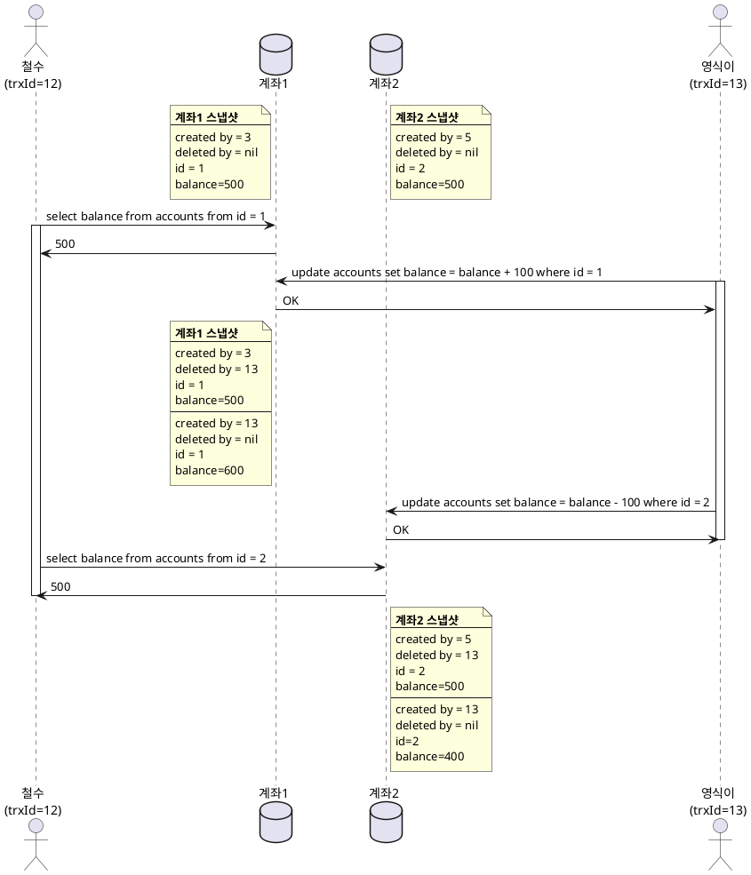

> 트랜잭션 없이 코딩하는 것보다 트랜잭션을 과용해서 병목지점이 생기는 성능 문제를 애플리케이션 프로그래머가 처리하게 하는 게 낫다고 생각한다.

## 트랜잭션과 현실 세계의 데이터 베이스
- 어플리케이션에서 몇 개의 읽기와 쓰기를 하나의 논리적 단위로 묶는 방법
- 프로그래밍 모델의 단순화 목적이며 잠재적 오류 / 동시성 문제를 무시할 수 있다.
- 트랜잭션이 매번 필요한 것은 아니며 보장을 완화하거나 아예 안쓰는게 이득일 수 있다.
- S/W, H/W는 언제라도 실패할 수 있다
- 어플리케이션은 언제라도 죽을 수 있다
- 네트워크 문제가 생기면 데이터베이스 노드 사이의 통신이 안될 수 있다
- 동시에 쓰기를 실행하면 다른 클라이언트가 쓴 내용을 덮어쓸 수 있다.
- 비정상적인 데이터를 읽을 수 있다.
- 예측하지 못한 버그를 유발할 수 있다.


## 모호한 트랜잭션 개념
- 새로운 세대의 데이터베이스 중 다수는 트랜잭션을 완전히 포기하거나 과거에 인식되던 것보다 훨씬 약한 보장을 의미하는 단어로 재정의
- 기존 DB 벤더들은 트랜잭션 보장을 "값진 데이터"가 있는 "중요 어플리케이션"에 필수적인 요구사항이라고 이야기하고 있음

### ACID
- 원자성(Atomicity), 일관성(Consistency), 격리성(Isolation), 지속성(Durability)
- 데이터베이스마다 ACID에 대한 구현은 제각각
> 상위 수준의 아이디어는 비슷/견실하지만 악마는 세부사항에 있다.
- 기본적으로 가용성을 제공하고, 유연한 상태를 가지며 최종적 일관성을 지니는 뜻으로 사용

#### 원자성(Atomicity)
- 더 이상 쪼갤 수 없는 무엇인가를 가리킴
> Multi Thread Model에서 하나의 스레드가 원자적 연산을 실행하면 다른 스레드에서 중간 상태를 관찰할 수 없고 실행 전 혹은 실행 후만 관찰 가능
- 여러 쓰기 작업이 Atomic 하게 묶여 있을때 결함으로 커밋을 할수 없다면 어보트되고 데이터베이스는 지금까지 실행한 쓰기를 모두 무시/취소해야 함. ACID 원자성의 결정적인 특징이다.

#### 일관성(Consistency)
- 데이터 관한 어떤 선언(불변식)
  * FK, PK와 같은 제약 조건
- 일관성을 유지하도록 트랜잭션을 올바르게 정의하는 것은 애플리케이션의 책임
- ***원자성, 격리성, 지속성은 데이터베이스의 속성인 반면 일관성은 애플리케이션의 속성***

#### 격리성(Isolation)
- 동시에 실행되는 트랜잭션은 서로 격리되는 것을 의미. 다시 말해, 동시에 실행되는 트랜잭션들은 서로 방해하지 말아야 한다.
- 데이터베이스는 실제로는 여러 트랜잭션이 동시에 실행됐더라도 트랜잭션이 커밋됐을 때의 결과가 트랜잭션이 순차적으로 실행됐을 때의 결과와 동일하도록 보장
- 직렬성 격리는 성능 손해를 동반하므로 현실에서는 거의 사용을 안한다.

#### 지속성(Durability)
- 트랜잭션이 성공적으로 커밋됐다면 H/W 혹은 S/W 결함이 발생하더라도 트랜잭션에서 기록한 모든 데이터는 손실되지 않는다는 보장. 보통 비휘발성 저장소에 저장되는 데이터에 대해 데이터 구조가 오염됐을 때 복구해주는 쓰기 전 로그(write-ahead log)와 비슷한 수단을 동반함.
- 지속성을 보장하려면 성공적으로 커밋됐다고 보고하기 전에 쓰기나 복제가 완료될 때까지 기다려야 한다.
> 현실에서 절대적 보장을 제공하는 한 가지 기법은 없다. 
디스크에 쓰기, 원격 장비에 복제하기, 백업 등을 포함해 위험을 줄이려는 기법이 여러 가지 있을 뿐이다. 
이들은 함께 쓸 수 있으며 그래야만 한다. 이론적인 `보장`은 약간 에누리해서 듣는게 현명하다.

### 단일/다중 객체 연산
- 철수와 영식이가 이메일 서비스를 이용하고 있다고 가정해보자.

- 위와 같은 상황에서 영식이는 이상한 경험을 하게 된다. 메일 내용은 존재하지만 메일박스에서 읽지 않은 메일은 0으로 표시되기 때문이다.
> 물론 이메일과 같은 도메인의 특성상 심각한 문제가 되는 지점은 아니다.

- 다중 객체(Row, Document 등) 연산에서는 읽기 연산/쓰기 연산이 동일한 트랜잭션에 속하는지 알아낼 수단이 있어야 한다. 대표적으로 `BEGIN TRANSACTION ~ COMMIT`이 있다. 비관계형 데이터베이스에서도 다중 연산을 지원하긴 하지만 연산을 묶는 방법이 없는 경우가 많다. redis multi 오퍼레이션의 경우 부분 실패 부분 성공을 볼수도 있다. 
### 다중 객체 트랜잭션의 필요성
- 많은 분산 데이터스토어는 다중 객체 트랜잭션 지원을 포기했다. 다중 객체 트랜잭션은 여러 파티션에 걸쳐서 구현하기가 어렵고 매우 높은 가용성과 성능이 필요한 곳에서는 방해가 되는 시나리오도 있기 때문이다. 
- ***원자성이 없다면 오류 처리가 훨씬 더 복잡해지고 격리성이 없으면 동시성 문제가 생길 수 있다.***
### 오류와 어보트 처리
- TX의 핵심은 ***오류가 생기면 어보트되고 안전하게 재시도할 수 있다는 것이다***
- 어보트된 트랜잭션을 재시도하는 것은 간단하지만 완벽하진 않다.
  * 실제로 성공한 트랜잭션이지만 커밋 중 네트워크 단절이 발생할 경우 재시도하면 별도의 중복 제거 메카니즘이 없다면 트랜잭션을 두 번 실행할수도 있다. 
  * 부하에 의한 재시도는 문제를 해결하기보다 악화시킬 수 있다. 이럴 경우 지수적 백오프 전략을 사용하여 별도로 처리하는 방법을 쓸 수 있다.
  * 위의 이메일 예제처럼 부수효과가 있는 경우 2단계 커밋이 도움이 될 수 있다.


## 완화된 격리 수준
- 동시성 문제는 TX가 다른 TX에서 동시에 변경한 데이터를 읽거나 두 TX가 동시에 같은 데이터를 변경하려고 할 떄만 나타난다.
- 문제 해결을 위해 직렬성 격리를 고려해볼 수 있지만 이는 동시성은 보장하겠지만 모든 이슈로부터 보호해주지 않는 완화된 격리 수준을 사용하는 시스템들이 흔하다.(인기있는 데이터베이스들 조차도 완화된 격리성을 사용하는 경우가 많다) 결국, 존재하는 동시성에 대한 종류를 잘 이해하고 방지하는 방법을 배우는 것이 필수다.

### 커밋 후 읽기(READ COMMITTED)
- 가장 기본적인 수준의 트랜잭션 격리
- 데이터베이스에서 읽을 때 커밋된 데이터만 보게된다.(Dirty Read가 없다)
- 데이터베이스에서 쓸 때 커밋된 데이터만 덮어쓰게 된다.(Dirty Write가 없다)

#### 더티 읽기 방지


- ***TX가 여러 객체를 갱신하는데 더티 읽기가 생기면 다른 TX에서 일부는 갱신된 값을, 일부는 갱신되지 않은 값을 볼 수 있다.***

#### 더티 쓰기 방지
- 먼저 쓴 내용이 아직 커밋되지 않은 트랜잭션에서 쓴 것이고, 나중에 실행된 쓰기 작업이 커밋되지 않은 값을 겊어써버리는 걸 `더티 쓰기(Dirty Write)`라고 한다.
- 두 TX에서 데이터베이스의 동일 객체를 갱신하려고 할때 일반적으로 나중에 쓴 내용이 먼저 쓴 내용을 덮어쓴다고 가정한다. `READ_COMMITTED` 격리 수준에서는 이러한 더티 쓰기를 방지해야 하며, 먼저 쓴 TX가 커밋/어보트될 때까지 두 번째 쓰기를 지연시키는 방법을 쓴다.


> 위 예제에서는 **더티 쓰기**가 발생하였고, 
***영식이와 철수 모두 같은 제품을 구매하는 상황에서 구매자는 영식이가 되고 송장은 철수로 찍혀 있는 상황이다.***

#### 커밋 후 읽기(READ_COMMITTED) 구현
- 커밋 후 읽기(READ_COMMITTED)는 Oracle, PostgreSQL, MS_SQL 등에서 기본 설정
- ***로우 수준의 잠금을 사용해 더티 쓰기를 방지하며 트랜잭션에서 특정 객체(로우/문서)를 변경하고 싶다면 먼저 해당 객체에 대한 잠금을 획득해야 한다. 그리고 트랜잭션이 커밋되거나 어보트될 때까지 잠금을 보유하고 있어야 한다. 오직 한 트랜잭션만 어떤 주어진 객체에 대한 잠금을 보유할 수 있고 다른 트랜잭션에서 동일한 객체에 쓰기를 원한다면 첫 번째 트랜잭션이 커밋/어보트된 후에야 잠금을 얻어 진행할 수 있다.***
- 더티 읽기를 막기 위해 동일한 잠금을 사용할 수 있다. 하지만, 현실적으로 잘사용하지 않고 응답 시간에 해를 끼치며 운영성이 나쁘다. 이러한 이유로 커밋 후 읽기(READ_COMMITTED)에서는 트랜잭션이 시작하면 과거에 커밋된 값과 새로운 값 모두 기억한다.
- 하지만, 커밋 후 읽기(READ_COMMITTED)에서도 동시성 버그가 생길 수 있는 경우가 많이 있다. 아래 계좌 잔고 예제를 살펴보자.


> 위 예제에서 일시적으로 철수는 계좌에서 100원이 갑자기 사라진처럼 보일 수 있다. 
영식이가 100원을 계좌1에서 꺼내 계좌2로 보내는 트랜잭션을 수행했고 
철수는 격리 수준에 따라 과거 커밋된 값인 계좌 1의 500원과 계좌2의 400원을 읽어 총액 1000원에서 900원으로 100원이 사라진처럼 보일 수 있다.

- 위와 같이 일시적으로 현상을 가리켜 비반복 읽기(Non-Repeatable-Read) 혹은 읽기 쓰큐(Read-Skew)라고 부른다. 커밋 후 읽기(READ_COMMITTED)에서 읽기 스큐는 받아들일 수 있는 것으로 여겨지지만 비즈니스마다 이런 일시적인 비일관성을 감내할 수 없는 경우도 존재한다.

### 스냅샷 격리와 반복 읽기
- 위 계좌 잔고 예제의 문제에서 일관된 읽기를 하지 못하는 것의 해결책으로 `스냅숏 격리`를 사용할 수 있다.
- 각 트랜잭션은 데이터베이스의 일관된 스냅샷으로부터 읽는다. 즉 트랜잭션은 시작할 때 데이터베이스에 커밋된 상태였던 모든 데이터를 본다. 데이터가 나중에 다른 트랜잭션에 의해 바뀌더라도 각 트랜잭션은 특정한 시점의 과거 데이터를 볼 뿐이다.
- 스냅샷 격리는 널리 쓰이는 기능으로 PostgreSQL, InnoDB 엔진을 사용하는 Oracle, MySQL, SQL_Server에서 지원된다.

#### 스냅샷 격리 구현
- 커밋 후 읽기(READ_COMMITTED)에서처럼 더티 쓰기를 방지하기 위해 쓰기 잠금을 사용한다.
- 같은 객체에 쓰기를 하는 경우 락을 획득한 트랜잭션에 먼저 진행하고 다른 트랜잭션은 앞의 트랜잭션이 락을 풀어줄때까지 기다려야 한다는 이야기다.
- 하지만, ***읽을 떄는 아무 잠금이 필요 없다. 읽는 쪽에서 쓰는 쪽을 결코 차단하지 않고 쓰는 쪽에서 읽는 쪽을 결코 차단하지 않는다.***
- 스냅샷 격리를 지원하는 저장소 엔진은 보통 커밋 후 읽기 격리를 위해서 MVCC를 사용한다.
> **MVCC(Multi-Version-Concurrency-Control)**
> 데이터베이스마다 커밋된 여러 버젼을 유지하며 진행 중인 여러 트랜잭션에서 서로 다른 시점의 데이터베이스 상태를 봐야 할 수도 있기 때문. 데이터베이스가 객체의 여러 버전을 함께 유지하므로 이 기법은 다중 버젼 동시성 제어 라고 한다.




#### 일관된 스냅샷을 보는 가시성 규칙
- 트랜잭션은 데이터베이스에서 객체를 읽을 떄 트랜잭션 ID를 사용해 어떤 것을 볼 수 있고 어떤 것을 볼 수 없는지를 결정
- 면밀한 가시성 규칙을 정의함으로써 데이터베이스는 데이터베이스의 일관된 스냅샷을 애플리케이션에 제공할 수 있음
  * 각 트랜잭션을 시작할 때 그 시점에 진행 중인 트랜잭션 목록을 만들고 해당 트랜잭션들이 쓰는 데이터는 모두 무시
  * 트랜잭션 ID가 더 큰 트랜잭션이 쓴 데이터는 그 트랜잭션 커밋 여부와 무관하게 모두 무시
  * 위 조건 외 모든 데이터는 쿼리를 통하여 볼수 있음
- 데이터베이스는 갱신할 때 값을 교체하지 않고 값이 바뀔 때마다 새 버전을 생성함으로써 작은 오버헤드만 유발하면서 일관된 스냅샷을 제공

#### 색인과 스냅샷 격리
- 색인이 객체의 모든 버전을 가리키게 하고 색인 질의가 현재 트랜잭션에서 볼 수 없는 버전을 걸래내게 하는 것이 일반적인 구현. 하지만, 현실에서는 세부 사항에 따라 MVCC의 성능이 결정됨.
#### 반복 읽기와 혼란스러운 이름
- 스냅샷 격리는 읽기 전용 트랜잭션에 유용하며 오라클에서는 `직렬성`, PostgreSQL과 MySQL에서는 `반복읽기(Repreatable Read)`라고 부른다
- ***이름이 혼란스러운 이유는 SQL 표준에 스냅샷 격리가 존재하지 않기 때문이다.*** 대신 비슷한 반복 읽기는 SQL 표준에 정의되어 있다.

### 갱신 손실 방지
- 동시에 실행되는 쓰기 트랜잭션 사이에 발생할 수 있는 흥미로운 종류의 충돌이 몇 가지 더 있는데 가장 널리 알려진 것은 `갱신손실(lost update)`이다.
- 갱신 손실 문제는 어플리케이션이 데이터베이스에서 값을 읽고 변경한 후 변경된 값을 다시 쓸 떄(read-modify-write 주기) 발생할 수 있다.
  * 카운터를 증가시키거나 계좌 잔고를 갱신할때
  * 복잡한 값을 지역적으로 변경할 떄
  * 사용자가 편집한 내용을 저장할 때 전체 페이지 내용을 서버에 보내서 현재 데이터베이스에 저장된 내용을 덮어 쓰도록 만들어진 위키에서 두 명의 사용자가 동시에 같은 페이지를 편집할 때
#### 원자적 쓰기 연산

```sql
UPDATE counters SET value = value + 1 WHERE key = `foo`;
```

- 데이터베이스가 제공하는 원자적 연산을 사용하면 보통 객체를 읽을 때 독점적인(exclusive) 잠금을 획득하여 구현하기 때문에 다른 트랜잭션에서 그 객체를 읽지 못하게 된다. 다른 말로 커서 안정선(cursor stability)라고 한다. 다른 선택지로 모든 원자적 연산을 단일 스레드에서 실행하도록 강제하는 것이 있다.
- ORM 구현체를 사용하면 보통 원자적 연산을 사용하지 못하고 read-modify-write 주기로 실행하는 경우가 많다. 이럴 경우 아래에서 설명하는 `명시적인 잠금`을 활용하는 방법이 좋다.

#### 명시적인 잠금
- 어플리케이션에서 갱신할 객체를 명시적으로 잠그는 것. `read-modify-write` 주기에서 사용할 경우 다른 트랜재겻ㄴ에 동시에 같은 객체를 읽으려고 하면 먼저 실행한 트랜잭션의 `read-modify-write`이 종료될 떄까지 기다리도록 강제할 수 있다.

#### 갱신 손실 자동 감지
- 원자적 연산과 잠금은 `read-modify-write` 주기가 순차적으로 실행되도록 강제함으로써 갱신 손실을 방지하는 기법인데, 대안으로 이들의 병렬 실행을 허용하고 트랜잭션 관리자가 갱신 손실이 발생하면 트랜잭션을 어보트시키고 read-modify-write 주기를 재시도하도록 강제하는 방법이 있다.
- PostgreSQL의 Repeatable Read, Oracle의 Serialiable, SQL 서버의 스냅샷 격리 수준은 갱신 손실이 발생하면 자동으로 발견해서 문제가 되는 트랜잭션을 어보트시킨다. 하지만, MySQL InnoDB의 Repetable-Read의 경우 갱신 손실을 감지하지 않는다.

#### Compare-And-Set
- Compare-And-Set 연산의 목적은 값을 마지막으로 읽은 후 변경되지 않았을 때만 갱신을 허용함으로써 갱신 손실을 회피하는 방법이다. 다시 말해, 아래 예제처럼 old content와 일치하지 않으면 값을 갱신하지 않는다. 하지만 ***오래된 스냅샷에서 값을 읽어오는 경우 이 구문은 갱신 손실을 막아주지 못한다.***
```sql
-- DB 구현에 따라 안전할수도/그렇지 않을 수 있다고 함.
UPDATE wiki_pages SET content = 'new content'
WHERE id = 1234 and content = 'old content';
```

#### 출동 해소와 복제
- 복제가 적용된 데이터베이스에서 갱신 손실을 막는건 또 다른 차원의 문제로 데이터가 다른 노드들에서 동시에 변경될 수 있으므로 갱신 손실을 막기 위해서는 추가적인 단계가 필요하다. 
- **복제가 적용된 데이터베이스에서 흔히 사용하는 방법으로 쓰기가 동시에 실행될 때 한 값에 대해 여러 개의 충돌된 버젼 생성을 허용하고 사후에 어플리케이션 코드가 다양한 데이터 구조를 활용하여 충돌을 해소하고 이 여러 버젼을 병합하는 방법을 사용한다.**
- 원자적 연산은 복제가 적용된 상황에서도 유용하며 특히 교환법칙(순서를 앞뒤로 바꿔서 해도 동일할 경우)이 성립하는 경우라면 그렇다.
- 최종 쓰기 승리(last write wins, LWW) 충돌 해소 방법은 갱신 손실 발생이 쉽다.

### 쓰기 스큐와 팬텀
- 동시에 실행되는 쓰기 작업 사이에 잠재적으로 발생할 수 있는 경쟁조건은 `더티 쓰기`, `갱신 손실` 말고도 더 존재한다. 특히 쓰기 스큐(write skew)가 대표적인 예이다.

#### 쓰기 스큐를 특정짓기
- 두 트랜잭션이 같은 트랜잭션을 읽어서 그중 일부를 갱신할 떄 나타날 수 있는 현상. 같은 객체에 쓰는 것이 아니기 때문에 더티 쓰기도 경신 이상도 아니다.
- 다른 트랜잭션이 하나의 동일한 객체를 갱신하는 경우라면 타이밍에 따라 더티 쓰기, 갱신 손실 이상을 경험하고 다른 객체에 해당하는 경우는 쓰기 스큐를 경험할 수도 있다.
- 앞에서 소개한 원자적 연산과 갱신 손실 자동 감지와 같은 기능도 이러한 쓰기 스큐 상황에서는 도움이 되지 않고, 이런 문제를 해결하는 차선의 방법으론 아래와 같이 읽는 시점에 잠금을 활용한 직렬성 격리 수준을 활용할 수도 있다. 

```sql
BEGIN TRANSACTION;

SELECT * FROM doctors
WHERE on_call = true
AND shift_id = 1234 FOR UPDATE;

UPDATE doctors
SET on_call = false
WHERE name = `Alice`
AND shift_id = 1234;

COMMIT;
```

- 아래와 같은 상황에서 까다로운 쓰기 스큐를 케이스를 접할 수도 있다.
  * 회의실 예약 시스템
  * 사용자명 획득
  * 이중 사용 방지

#### 쓰기 스큐를 유발하는 패턴
- 어떤 트랜잭션에서 실행한 쓰기가 다른 트랜잭션의 검색 질의 결과를 바꾸는 효과를 팬텀(phantom)이라고 한다. 스냅샷 격리는 읽기 전용 질의에서는 팬텀을 회피하지만 읽기 쓰기 트랜잭션에서는 팬텀이 쓰기 스큐의 특히 까다로운 경우를 유발할 수 있다.
#### 충돌 구체화
- 충돌 구체화(Materializing Conflict)는 팬텀이 발생할 수 있는 데이터베이스 구체적인 로우 집합에 대해 잠금으로 변환하여 해당 로우를 잠궈 생길 수 있는 팬텀 상황을 방지하는 기법이다.(인위적으로 데이터베이스에 잠금 객체를 추가) 회의실 예약과 같은 도메인 상황에서는 회의실 예약 시간 슬롯 혹은 회의실에 대한 테이블을 별도로 만들어두는 방법을 생각할 수 있다.
- 충돌 구체화는 동시성 제어 모델이 어플리케이션 데이터 모델로 세어나오기 때문에 보기가 좋지 않으며 해결할 수 있는 방법이 없는 경우 최우의 수단으로 활용하며 대부분 이런 경우 직렬성 격리 수준을 사용하는 것이 나을 수 있다.