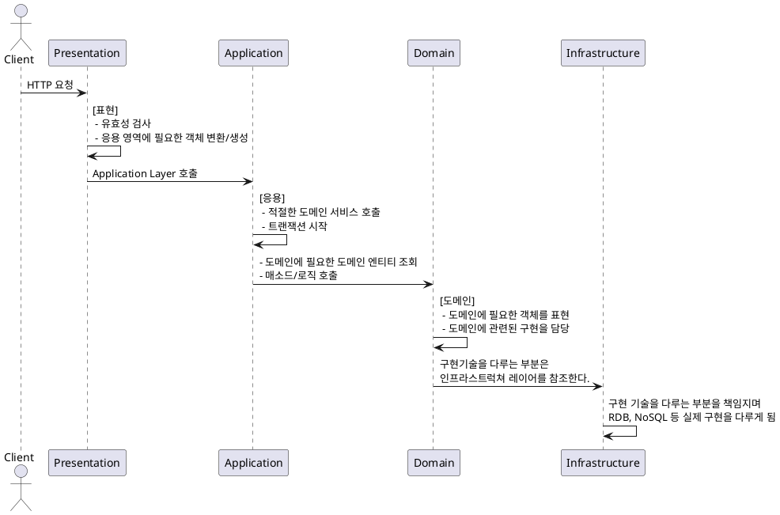
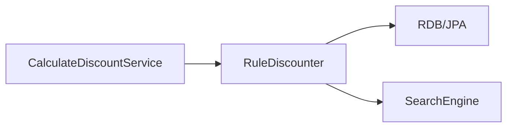

# DDD Start - 2장

> DDD Start의 2장 내용을 정리

## 아키텍처 / 네 개의 영역? / 계층 구조 아키텍처


아키텍처를 구성하는 요소는 크게 4가지로 나뉠 수 있다. `표현`, `응용`, `도메인` 및 `인프라스트럭처`로 나뉠 수 있으며, 각 계층별로 가져야 할 책임은 위 다이어그램을 통하여 확인이 가능하다.

- **표현 레이어**의 경우, 사용자 혹은 외부 클라이언트의 요청을 받는 첫 관문이며, 해당 레이어에서는 요청에 대한 유효성 검사 및 응용 레이어 호출을 위한 객체 생성 및 변환 작업이 주로 이뤄진다.

- **응용 레이어**는 도메인 서비스를 호출하며 대부분의 경우 응용 서비스에 대한 트랜잭션이 시작되는 지점이다. 도메인에 필요한 구현을 직접 수행하진 않으며, 도메인 영역의 객체에 이를 위임하게 된다

- **도메인 레이어**는 도메인에 필요한 데이터를 표현하고 도메인과 관련된 구현을 담당하게 된다.
- **인프라스트럭쳐 레이어**는 실제 구현을 담당하게 되는데, 구현 기술과 아주 밀접한 연관이 있는 레이어이다. 응용 레이어 및 도메인 레이어는 구현기술과 관련된 부분은 인프라스트럭처 레이어에 의존하게 된다.

> 각 계층은 표현 -> 응용 -> 도메인 -> 인프라스트럭쳐 순으로 의존하게 하게 되지만, 구현의 편리함을 위하여 응용 -> 인프라스트럭쳐 혹은 도메인 -> 인프라스트럭쳐를 참조하는 방식으로 의존할 수도 있다.


응용, 도메인 계층이 직접적으로 인프라스트럭처 레이어에 의존적이게 되면 실제 구현 부분에 대한 변경이 어려워지며, 테스트하기 어려워지는 문제점이 발생하게 된다. **DIP를 이용하면 저수준의 구현 모듈이 고수준의 모듈에 의존하도록 변경하여 위에서 발생하는 문제를 해결할 수 있는 실마리를 제공해준다.**

## DIP

> 객체지향 원칙 SOLID에서의 DIP
> 추상을 매개(인터페이스)로 메시지를 주고 받음(메서드 호출)으로써 관계를 최대한 느슨(인터페이스를 사용함에 따라 구현에 대한 변경이 용이)하게 만드는 원칙
> - [나무위키, 객체 지향 프로그래밍 원칙 중 DIP](https://namu.wiki/w/%EA%B0%9D%EC%B2%B4%20%EC%A7%80%ED%96%A5%20%ED%94%84%EB%A1%9C%EA%B7%B8%EB%9E%98%EB%B0%8D/%EC%9B%90%EC%B9%99#s-2.5)
> - [Nextree, DIP](http://www.nextree.co.kr/p6960/)

DIP를 적용하게 되면 아래와 같이 구현 기술과 관련된 종속성을 쉽게 제거할 수 있는데, 저수준의 모듈이 고수준의 모듈을 참조하도록 구성하는 방법. 즉 인터페이스를 참조하게 되면 실제 인터페이스의 구현 부분에서 사용하는 구현 기술이 어떤 종류의 것인지와 상관없이 도메인에서 필요한 기능 자체에만 집중한 표현이 가능하다.



- 위 이미지에서 볼 수 있듯이 실제 구현이 RDB로 되어 있던지, 검색엔진을 통하여 되어 있던지 이는 중요하지 않고 실제 구현하고자 하는 `가격할인`이라는 목적에만 집중 할 수 있다. 
- 인터페이스를 사용함에 따라 실제 테스트 코드 작성 시, 쉽게 목(Mock) 구현을 할 수 있으며 또한 구현 변경에 따른 부담이 줄게 될 것이다.

> 위 설명에서 말하는 저수준과 고수준을 나누는 기준은 구현 기술에 좀 더 특화되어 있는 모듈이라면 저수준으로 판단하며, 응용 혹은 도메인 영역에서 사용하는 모듈은 고수준으로 분류한다. 
> 실제 도메인에서 표현하는 추상화 된 응용 혹은 도메인 계층을 고수준의 모듈이라고 보는 것이 타당하다고 생각한다. 다시 말해, 실제 도메인이 해결해야 할 문제에 대한 추상화가 이뤄지는 구간정도로 요약하면 좋을꺼 같다.

> *DDD Start 59P 중 일부*
> *인프라스트럭처에 위치한 클래스가 도메인이나 응용 영역에 정의한 `인터페이스`를 상속받아 구현하는 구조가 되므로 도메인과 응용 영역에 대한 영향을 주지 않거나 최소화하면서 구현 기술을 변경하는 것이 가능하다.*

## 도메인 영역의 구성요소는?
| 요소  | 설명 |
|---|---|
| **엔티티**  | 식별자를 가지는 객체. 라이프 사이클을 가진다.  |
| **벨류**  | 완전한 하나의 값을 표현. 도메인의 속성을 표현하는 목적으로 주로 사용한다.  |
| **애그리거트**  | 연관 객체의 집합을 가리킨다. 다시 말해, 관련된 엔티티와 벨류 객체를 개념적으로 하나로 묶어 놓은 것이다.  |
| **레파지토리**  | 도메인 모델의 영속성을 처리한다.  |
| **도메인 서비스**  | 특정 엔티티에 종속적이지 않은 도메인의 로직을 제공  |

위에서 설명한 내용을 간단하게 패키지 구조로 표현하면 아래와 같이 표현할 수 있다.
```
|-- order
    |-- domain
        |-- Order(Aggregate, Root-Entity)
        |-- OrderLine(Entity)
        |-- Orderer(Entity)
        |-- OrderRepository(Repository)
        |-- Address(Value)
```

> `DB 테이블의 엔티티` vs `도메인 모델의 엔티티`
> 가장 큰 차이점은 바로 도메인 모델 엔티티는 데이터와 도메인의 기능을 함께 표현하는 것이다. 테이블의 엔티티는 말 그대로 테이블의 데이터만을 표현하게 되는데, 비슷하면서 미묘하게 다른 지점이 생기는데, 여기서 반드시 중심을 잡고 알아야 할 사실은 바로 **도메인 모델은 데이터와 도메인의 기능을 함께 표현한다는 점이다.**


도메인 모델의 엔티티를 집중하여 살펴보면 위에서 말한대로 도메인의 데이터 담고 있으며 또한 도메인의 관점에서 기능을 구현해놓은 객체이다. 데이터에 대한 변경을 철저하게 도메인 관점에서 구현해야 하며 임의로 해당 엔티티의 상태 값이 변경되도록 하면 안된다. 이를 달성하기 위해서는 아래와 같은 점을 명심하면 좋을거 같다.
- ***세터(setter)의 지양***, 무분별한 상태 변경은 `지양`해야 하며, 객체의 세터를 만들더라도 `private` 접근자를 할당하며 외부에서 접근이 안되도록 해야 한다.

- **도메인 엔티티 생성 시, `정적 팩토리 매서드` 혹은 `팩토리 클래스`를 사용**, 도메인 객체의 생성은 반드시 완전한 상태로 이뤄져야 한다. 객체의 생성 규칙 일정하다면 `정적 팩토리 메서드`를 활용하는 방법이 좋고, 만약 객체를 생성하는 규칙이 다양하면 별도의 `팩토리 클래스`를 구현하는 방법도 좋다.


- **의미 혹은 개념적으로 하나로 표현할 수 있는 상황이라면 `벨류(Value)` 객체를 적극적으로 활용하는게 좋다.** 이에 대한 구현은 불변(Immutable)한 접근을 통하여 객체 자체를 완전히 교체하는 전략을 취하자

### 애그리거트(Aggregate)
- 비슷한 도메인 모델을 상위 수준에서 접근. 다시 말해, ***연관/관련 객체를 하나로 묶은 군집.***
- 예를 들어, 주문이라는 도메인 모델은 배송지, 주문자, 주문 목록 등의 하위 모델로 구성되는데 이 모든 모델을 하나의 군집 형태로 표현하여 `주문`이라는 상위 개념으로 표현할 수 있게 된다.
- 애그리거트는 연관된 객체/도메인 모델을 관리하는 루트 엔티티를 가지게 되는데, 루트 엔티티는 연관 객체와 벨류 등을 사용하여 도메인에서 표현해야 할 혹은 구현해야 할 기능을 제공하게 된다.
- 하위 객체 혹은 벨류에 대한 접근은 루트 엔티티를 통하여 간접적으로 이뤄져야 하며, 실제 구현을 내부로 숨길 수 있게 됨에 따라 애그리거트 단위로 캡슐화할 수 있도록 돕는다.

### 레파지토리(Repository)
- **구현을 위한 도메인 모델**로 도메인 객체를 영속성 있게 즉, 지속적으로 사용하려면 별도의 보관이 필요하게 된다. 이런 보관을 위하여 존재하는 것이 바로 레파지토리이다.
- 저장은 주로 RDB, NoSQL 등의 구현 기술을 사용하게 된다.
- 주로, ***에그리거트 단위로 객체를 저장하고 조회하는 기능을 구현하게 된다.***
- 레파지토리 인터페이스는 주로 도메인 영역에 속하게 되며, 해당 인터페이스의 구현체는 실제 구현 기술을 사용하게 됨에 따라 인프라스트럭처 영역에 속하게 된다.
- *응용영역과 밀접한 관련*이 있으며, 응용 영역에서는 필요한 도메인 객체를 조회하거나 저장 할때 레파지토리를 참조하게 된다. 또한, 응용 영역의 트랜잭션 관리는 레파지토리를 구현하는 기술에 영향을 받을 수 밖에 없다.

## 인프라스트럭처
- 표현, 응용, 도메인을 영역을 지원하는 역할을 수행
- 위에서 설명한 DIP처럼, 인프라스트럭처 레이어의 기능을 바로 사용하는 것이 아니라 인터페이스를 통하여 참조/구현하는 것이 테스트 하기 쉽게 만들어주며 변경에 용이하게 해준다.

## 모듈 구성/패키지 구조는?
### 영역별로 구성
- 응용/도메인 모듈에서는 연관 서비스/엔티티끼리 묶어서 다시 패키징을 할 수 있다.
```
|-- presentation
|-- domain
    |-- order
    |-- member
|-- application
    |-- order
    |-- member
|-- infrastructure
```

### 도메인별로 구성
- 도메인이 크다면 서브 도메인(하위 도메인)별로 나뉘는 전략
```
|-- order
    |-- presentation
    |-- domain
    |-- application
    |-- infrastructure
|-- member
    |-- presentation
    |-- domain
    |-- application
    |-- infrastructure
```


### Spring 프로젝트에서의 일반 구조는?
위에서 정리한 패키지 구조/명칭을 그대로 따라는 것도 좋은 접근이지만 여태까지 겪어봤던 구조도 한번 다시 정리해보는 것이 좋을거 같아 아래에 기술해봤다. 

#### 레이어 패키지 단위 구조
- 레이어 단위로 구성하는 방법
- 개인적으로 적절한 팀에서의 가이드가 존재하지 않는다면 선호하지 않는 방법이다. 왜냐하면, 무분별한 DI가 쉽게 발생 할 수 있으며, 각 레이어에서 개별 모듈이 관심사가 다른 레이어의 모듈이나 객체를 쉽게 참조할 수 있게 되기 때문이다. 
```
|-- controller
|-- service
|-- repository
|-- model
|-- config
|-- Application.java
```

#### 도메인 단위의 패키지 구조
- 관심 도메인별로 패키지 구조를 작성
- 위에서도 언급한 내용대로 개별 도메인별로 타입의 개수가 늘어나거나 관심사별로 다시 분리해야 할 경우 도메인 패키지내에서 다시 분리하는 전략도 취해볼 수 있다.
```
|-- order
    |-- OrderController.java
    |-- OrderService.java
    |-- OrderRepository.java
    |-- Order.java
    |-- OrderLine.java
    |-- Orderer.java
|-- member
|-- config
|-- Application.java
```

> 결국 레이어 단위로 두느냐 아니면 도메인 단위로 두느냐는 같이 프로젝트를 수행하는 구성원들의 호불호에 의해서도 달라질 수 있고, 도메인별로 상호간에 참조가 아예 안되는 상황인지 아닌지 유무도 중요하게 된다. 무분별하게 어떤 접근이 맞다는 의견보다는 상황과 요구사항 그리고 팀원들의 이해도에 집중하여 접근하는 것이 중요하다고 할수 있다.
