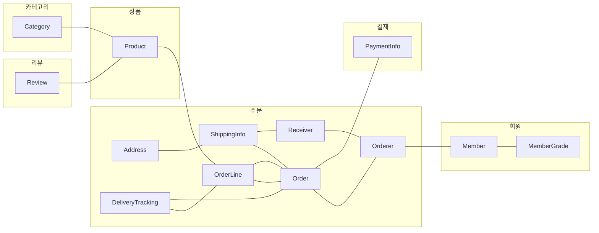
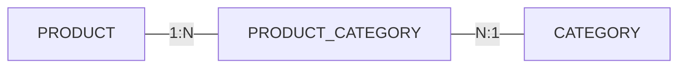

# DDD Start - 3장

> DDD Start의 3장 내용을 정리

## 애그리거트(Aggregate)
### 도메인 모델에 대한 파악과 애그리거트
- **상위 수준에서의 접근**과 **개별 객체 혹은 구현 단위**에서의 접근으로 나눌 수 있다. 상위 수준에서의 이해가 없는 상태에서 개별 객체에 대해 모델링을 하거나 개발을 하게 되면 상위 수준에서의 도메인 간의 관계가 어려워지게 된다.
  > 상위 수준에서 올바른 이해를 바탕으로 개별 객체에 대한 모델링을 진행해야지 전체 모델링을 망가트리지 않으면서 추가 요구사항을 수행할 수 있기 때문에 큰 그림에서의 도메인 모델에 대한 이해는 필수이다.
- 애그리거트 단위로 묶어서 상위 모델을 바라보면 상위 수준에서 도메인 모델 간의 관계를 쉽게 파악할 수 있다.



- 애그리거트 단위로 모델링을 하게 되면 좀 더 일관성 있는 구조를 가질 수 있게 되며, 일관성이 확보되는 만큼 복잡한 도메인 모델을 단순하고 확장에 용이한 구조로 가져갈 수 있게 된다.

- 구현 모델에서 즉, 실제 애그리거트 단위로 객체를 만들게 되면 연관 객체(벨류, 엔티티)를 함께 생성하고 이에 대한 라이프사이클도 동일하게 가져가게 될 가능성이 높다.

- 위 도표에서도 볼 수 있는 내용이지만, 애그리거트는 **경계**를 가지게 된다. **경계를 정하는 기준은 도메인 규칙과 요구사항을 기준으로 하면 된다.** 기준에 따라 함께 생성되는 객체나 요소들은 애그리거트로 묶일 가능성이 높게 된다.

- 생성하고 변경하는 주체가 다르다면 같은 애그리거트로 묶이기 힘들 수 있다. 좋은 예가 바로 상품/리뷰의 관계이다. 상품은 담당자가 생성/변경하고 리뷰의 경우 실제 고객이 생성/변경하기 때문이다.
  > 상품과 리뷰를 동시에 조회해야 하는 요구사항이 생긴다면 별도로 조회 전용에 대한 도메인(DAO)을 만들어서 구현하면 된다. 보통의 경우, 응용 영역에서 개별 애그리거트를 조회하여 이를 조합하는 형식이면 된다고 생각한다.

### 애그리거트 루트
- 애그리거트를 대표하는 엔티티 객체이며 **루트 엔티티**라고 부르기도 한다. 애그리거트에 속한 객체는 루트 엔티티에 직접/간접적으로 속하게 된다.
- 애그리거트는 여러 객체로 구성되기 때문에 특정 객체만 만들어지는 상황이 생기면 안된다. 도메인의 규칙과 요구사항을 충실하게 지키기 위해서는 애그리거트에 속한 객체가 온전히 정상 상태를 가질 수 있어야 한다. 이러한 **일관된 상태/일관성**를 유지하기 위해서는 담당/관리할 객체가 필요하게 된다. 이것이 바로 `애그리거트 루트`이다.
- 일관성을 유지해야 하기 때문에, 애그리거트 루트는 연관 객체들의 상태에 대한 제어권을 가지게 되며 도메인 기능에 대한 실제 구현을 담당하게 된다.
- 애그리거트 루트가 아닌 외부에서 애그리거트에 속한 객체에 대한 직접적인 접근을 못하도록 해야 한다. 
- 도메인에 대한 구현을 응용 영역에서 담당할 수도 있지만, 이는 곧 여러 응용 클래스에서 도메인에 대한 중복 구현이 발생하게 되는 원인이 되게 된다. 가급적이면 응집성 있게 도메인 클래스에서 구현을 담당하도록 해야 하며 이를 지키기 위해서는 **세터 사용 지양** 그리고 **벨류 타입에 대한 불변 클래스 적극적 활용**하는 방법을 습관화 시켜야 한다.
  > 세터를 외부에서 접근하게 되면, 엔티티의 상태 변화 제어가 어려워진다. 다시 말해, 상태 변경에 대하여 왜/어떻게 변했는지에 대한 추적이 어려워진다. 
  > 실제 어플리케이션 코드를 작성하다보면 이를 지키지 않고 습관적으로 게터/세터를 만들어 쓰는 것을 너무 많이 구경해왔다. 실제 초기 단계에서는 도메인에 대한 구현이나 요구사항이 복잡하지 않아 생기는 문제가 적겠지만, 추후 도메인과 비즈니스가 확장됨에 따라 변경이 발생하고 코드 베이스가 길어지면 관리하기 힘들어 지는 것이 자명한 사실이다. 코드 베이스가 길어지면 어쩔 수 없는 일이라고 생각하는 사람도 있겠지만 길어지더라도 변경에 대한 이유와 근거가 명확한 것이 추후 유지보수성이나 확장에 유리하다고 생각한다. 
  > 이러한 차원에서 가급적이면 세터 사용을 지양하고 도메인 클래스 혹은 도메인 서비스에서 상태 변경을 제어하도록 하여 일관성 있는 구현을 유지하는 것이 중요하다고 할 수 있다.

- 엔티티 클래스 예시
```kotlin
@Embeddable
data class ArticleContent (
    val content: String = "",
    val contentType: String = ""
)


@Entity
@Table(name = "article")
@SecondaryTable(
    name = "article_content",
    pkJoinColumns = [PrimaryKeyJoinColumn(name = "id")]
)
class Article private constructor() {
    companion object {
        fun create(
            title: String = "",
            content: ArticleContent = ArticleContent()
        ) = Article().apply {
            this.title = title
            this.content = content
        }
    }

    @Id
    @GeneratedValue(strategy = GenerationType.IDENTITY)
    var id: Long = 0L
        protected set

    var title: String = ""
        protected set

    @Embedded
    @AttributeOverrides(
        value = [
            AttributeOverride(
                name = "content", column = Column(table = "article_content")
            ),
            AttributeOverride(
                name = "contentType", column = Column(table = "article_content")
            )
        ]
    )
    var content: ArticleContent = ArticleContent()
        protected set

    fun modifyContent(content: ArticleContent) {
        this.content = content
    }

}
```
위 클래스는 코틀린으로 작성한 JPA 엔티티 클래스이다. 여러 어노테이션을 사용해서 다소 복잡한 부분이 있긴 하겠지만, 애그리거트에 대한 충실한 구현을 한 클래스라고 생각한다.
  - 세터 사용 제한
  세터에 대한 접근 제한을 `protected` 로 지정하여 외부에서 프로퍼티에 대한 상태 변경을 하지 못하도록 함
  - 불변 객체 사용
  `ArticleContent`의 경우 코틀린의 데이터 클래스를 활용하였으며 실제 벨류 객체가 가지고 있는 값은 불변 프로퍼티(`val`)로 해당 값을 변경하기 위해서는 애그리거트에 있는 `content`값을 수정해야 한다. 세터에 대한 접근을 외부에서 할수 없기 때문에, 결국 애그리거트 클래스의 메서드를 활용하여 변경해줘야 하는데 변경은 `modifyContent`라는 메서드를 통하여 가능하다. 세터를 사용할때보다 좀 더 의미가 명확하다고 할 수 있다.

#### 애그리거트 루트의 기능 구현
- 애그리거트 루트는 내부의 연관 객체를 조합하여 기능을 완성하게 된다.
- 도메인 규칙상 직접 기능 구현이 어려운 경우 기능 실행을 연관 객체에 위임할 수도 있다.
- 주문 엔티티 예시
  - 주문 목록 벨류 객체들을 참조하여 총 주문 금액을 구하는 예시
    ```kotlin
    @Entity
    @Table(name = "purchase_order")
    @Access(AccessType.FIELD)
    class Order protected constructor() {
        // ... 생략

        @Column(name = "total_amounts")
        @Convert(converter = MoneyConverter::class)
        var totalAmount: Money = Money()
            protected set

        @ElementCollection
        @CollectionTable(
            name = "order_line",
            joinColumns = [
                JoinColumn(name = "order_number")
            ]
        )
        @OrderBy(value = "line_idx")
        var orderLines: MutableList<OrderLine> = mutableListOf()
            protected set

        private fun calculateTotalAmounts() {
            this.totalAmount = Money(
                totalAmount = this.orderLines
                    .asSequence()
                    .map { it.price.totalAmount * it.quantity }
                    .sum()
            )
        }
    }
    ```
  
#### 트랜잭션
- 트랜잭션의 범위는 작을수록 좋기 때문에, 가급적이면 애그리거트 단위로 트랜잭션을 제한하는 것이 좋다.
- 한 트랜잭션에서 하나의 애그리거트만을 수정한다는 이야기는 결국 다른 애그리거트를 트랜잭션의 범위에 포함시키지 않겠다는 이야기와 같다. 애그리거트간의 의존이 생기기 시작하면 결국 결합도가 높아지게 되고 이는 곧 수정 비용이 증가하게 되므로 가급적이면 트랜잭션의 범위는 하나의 애그리거트로 제한하는 것이 좋다.
- 만약, 여러 애그리거트를 수정해야 하는 상황이 생긴다면 `도메인 이벤트`를 구현하는 방법을 고려해보는 것이 좋다. 도메인 이벤트 구현을 사용하면 애그리거트간의 트랜잭션을 분리할수도 있으며 또한 구현 자체를 나눠서 할 수 있기 떄문에 코드에 대한 복잡성 역시 낮아지게 된다.

### 레파지토리와 애그리거트
- 애그리거트는 하나의 도메인 모델을 표현하고 있으므로, 도메인 모델의 영속성을 처리하는 레파지토리 또한 하나만 존재하는 것이 맞다.
  - **물리적으로 별도의 테이블에 저장한다고 해서, 별도의 레파지토리를 각각 만들지는 않는다.**
- 레파지토리는 최소 저장(`save`) 및 식별자 조회(`findById`)를 구현해줘야 한다. Data-JPA를 사용하게 되면 레파지토리에서 기본적으로 제공해야 하는 대부분의 기능을 커버하고 있기 때문에 구현이 어렵지 않다.
- 애그리거트는 개념적으로 하나이기 때문에, 애그리거트 전체를 저장소에 영속화해야 한다.
  - 만약 연관 엔티티/벨류 중 일부만 반영되면 일관성이 깨지므로 문제가 된다.


### ID를 이용한 애그리거트 참조
- 하나의 애그리거트에서 다른 애그리거트를 참조할 떄, 애그리거트의 관리 주체가 애그리거트 루트이므로 다른 애그리거트 루트를 참조한다는 이야기와 같다.
- 다른 애그리거트를 참조하는 방법은 `연관관계`를 활용하는 방법도 있지만, 경계가 불분명해지고 확장 및 성능에 대한 이슈가 생길 수 있기 때문에 지양하는 것이 좋고, **ID를 활용하여 다른 애그리거트를 참조하는 것이 그나마 나은 방법이다.**
  - 연관 관계를 매핑하게 되면 객체 그래프가 복잡해짐에 따라 트랜잭션에 대한 범위를 지정하는 것이 애매해질 수 있다.
  - 결합도가 높아짐에 따라 수정/변경이 어려워진다. 또한, 서브도메인별로 시스템을 확장하거나 분리해야 할 경우, 애그리거트간에 관계 매핑때문에 변경하고 수정해야 할 부분이 많아질 수 밖에 없다.
  - 애그리거트를 직접 참조하게 되면 패치 전략에 대한 판단도 해줘야 한다. 부가적으로 N+1에 대한 체크도 해줘야 하기 때문에 여러모로 손이 갈 수밖에 없다고 생각한다.

- ID 참조를 활용하게 되면, 애그리거트 단위별로 경계가 명확해질 수 있으며 또한 하나의 애그리거트가 다른 애그리거트를 수정할 수 있는 문제를 원천적으로 막을 수 있게 된다. 또한, 애그리거트별로 다른 구현 기술을 사용할 수 있다. 트랜잭션이 중요한 애그리거트에는 RDBMS를 사용하고 조회/삽입/삭제 성능이 중요한 애그리거트에는 NoSQL(MongoDB, DynamoDB)등을 활용하는 전략을 사용할 수 있게 된다.
  - 구현 기술이 달라지면 한 번의 쿼리로 해결을 할 수 없기 때문에, 별도의 캐시를 적용하거나 조회 전용 저장소를 구현하여 대응하면 된다.

- **ID 참조를 이용하게 되었을 떄, 문제가 되는 부분이 하나 있는데 `조인`을 사용해야 하는 조회 관련 도메인에 대한 구현이다.** 해당 구현은 직접 코드로 해결하는 방법도 있지만 **별도의 조회 전용 도메인**을 작성하는 방법을 사용하는 것이 적절하다. JPA/Hibernate에서도 이런 조회 전용 도메인을 구현하는 방법을 제공해주고 있는데 바로 `@Subselect`를 이용하는 방법이다. 별도로 서브쿼리절을 사용하기 싫다면 Native쿼리를 매핑하여 사용하는 방법도 존재한다.


### 애그리거트 간 집합 연관
- 애그리거트간에 1:N, N:M의 관계를 정의하게 되면 주로 콜렉션을 활용하여 매핑을 하게 된다.
- 보통 1:N의 경우, 성능상의 이슈가 있기 때문에 구현하는 경우가 드물다. 하지만 N에 해당하는 데이터 개수가 고정적이고 많지 않은 상황이라면 충분하게 사용할 수 있다고 생각한다. 또한 이런 경우에 모든 데이터를 패치해오는 것이 아닌 나눠서 쿼리하여 매핑할 수 있도록 하이버네이트에서는 `@BatchSize`와 같은 어노테이션을 제공해주고 있다.
- 카테고리와 상품 애그리거트의 예를 들어 설명해보자면, 일반적인 조회 구현에서 하나의 카테고리에 속한 모든 상품을 조회하는 경우는 드물기 때문에, 먼저 조회해야 하는 카테고리의 식별자를 구하고 해당 식별자를 기준으로 상품 애그리거트를 조회하는 로직을 만드는 경우가 많다.
- M:N의 경우, RDBMS를 이용하여 엔티티를 매핑해야 할 경우 보통 조인 테이블 전략을 많이 사용하게 된다. 아래 상품과 카테고리의 예를 살펴보면 쉽게 이해할 수 있는데, 상품 하나가 반드시 하나의 카테고리에만 속하는 것이 아니라 N개의 카테고리에 속할 경우를 생각해보면 매핑 데이터를 영속화 시킬 테이블이 필요하게 된다. 이 경우 조인테이블로 `PRODUCT_CATEGORY`를 사용하게 되는 것이다.


- 아래는 상품 애그리거트 기준으로 조인 테이블 매핑 예시를 보여주고 있다.
```kotlin
@Entity
@Table(name = "product")
class Product protected constructor() {
	@EmbeddedId
	lateinit var id: ProductId
		protected set

	@ElementCollection
	@CollectionTable(
		name = "product_category",
                joinColumns = [JoinColumn(name = "product_id")]
	)
	lateinit var categoryIds: MutableSet<CategoryId>
		protected set
}
```


### 애그리거트를 팩토리로 사용하기
- 애그리거트 객체를 생성할 떄, 도메인의 요구사항에 따라 처리 로직이 필요한 경우 이를 응용 레이어에서 구현하는 경우를 쉽게 볼 수 있는데, 이런 구현 방법도 틀리진 않았지만 중요 로직 처리가 응용 레이어에 노출됨에 따라 추후에 중복 가능성이 생기게 된다. 보통 이런 경우 애그리거트에서 해당 기능을 구현하게 되면 응집성 있는 코드 구현이 가능하고 또한 연관 엔티티를 참조하여 풍부하게 도메인의 요구사항을 표현할 수 있게 된다.
- 애그리거트에 구현하기 힘들다면 별도로 `도메인 서비스`를 구현하거나 `팩토리 클래스`를 구현하는 방법을 생각해보는 것도 좋다.