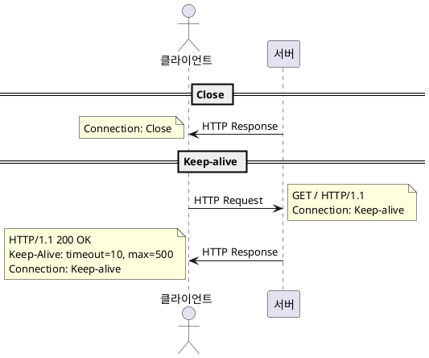

# 그림으로배우는HTTP - 6. HTTP 헤더

부가적으로 중요한 정보를 담고 있는 역할
HTTP 메시지 크기, 사용하는 언어, 인증, 브라우저 정보 등


## 용도에 따른 구분
- General Header Field
HTTP Reqeust와 Response에 모두 사용하는 공용 헤더 필드
- Request Header Field
- Response Header Field
- Entity Header Field

## 캐시 혹은 비캐시 동작에 따른 구분
### End-To-End Header
최종 수신자(클라이언트, 서버)에게 전달해야 할 헤더
### Hop-By-Hop Header
한 번 전송에 유효한 헤더, 프록시나 캐시에 의해 전송되지 않을 수 있음. HTTP/1.1 이후에는 Hop-By-Hop 헤더는 Connection 헤더 필드에 열거해야 함.
- Connection
- Keep-Alive
- Proxy-Authenitcate
- Proxy-Authorization
- Trailer
- TE
- Transfer-Encoding
- Upgrade

    
## General Header Field
### Cache-Control
Directive를 사용하여 캐싱 동작 지정 가능, Directive는 파라메터 지정이 가능한 것과 아닌 것이 존재함.
#### 캐시 가능 여부 디렉티브
- public: 전체 대상
- private: 특정 대상
- no-cache: 캐싱 정책 사용 안함, 헤더명을 지정하면 해당 헤더 값은 캐싱 안함.
#### 보존 가능 여부 제어
- no-store: 기밀 정보 포함에 따른 캐싱 정책 사용 안함을 명시
#### 캐시 기한 혹은 검증
- s-maxage
    - max-age와 역할은 동일, 다른 점은 다수에게 적용할 수 있는 캐시 서버에 적용
    - 해당 디렉티브 사용 시, Expires 및 max-age 디렉티브 무시

- max-age
    - 요청의 경우, 지정한 값이 0이면 매번 오리진 서버에 요청
    - 응답의 경우, 리소스 캐시를 보관해두는 최대 시간을 나타냄, Expires 헤더와 같이 사용할 경우, Expires 헤더 무시, HTTP/1.0의 경우 반대

- no-transform
    - 미디어 타입을 변경하지 않도록 지정하며 이미지 등이 압축되는 것을 방지

### Connection
#### 프록시에 더 이상 전송하지 않을 헤더 필드를 지정
더 이상 전송하지 않는 헤더 필드를 지정할 수 있음(Hop-By-Hop Header)
#### 지속적 접속 관리
- 서버 측에서 명시적으로 접속을 끊고 싶을 경우 Connection 헤더 필드에 Close라고 지정
- HTTP/1.1 이전에서는 지속적 접속을 디폴트로 사용하지 않았음, 명시적으로 헤더에 포함시켜야 했음.**(HTTP/1.1의 경우 디폴트로 지속적 접속을 사용)**


### Date
- HTTP 메세지 생성 날짜를 표현
### Pragma
- HTTP/1.1 이전 스펙의 헤더, 클라이언트 리퀘스트의 경우에만 사용
- 클라이언트에서 캐시된 리소스를 원하지 않을 때 아래와 같이 표현
```http
...
Pragma: no-cache
...
```
- 일반적으로 요청을 보내는 서버의 HTTP 버젼을 모르는 경우가 많기 때문에 캐시를 허용하지 않을 경우 아래와 같이 헤더 정보를 명시
```http
Pragma: no-cache
Cache-Control: no-cache
```
