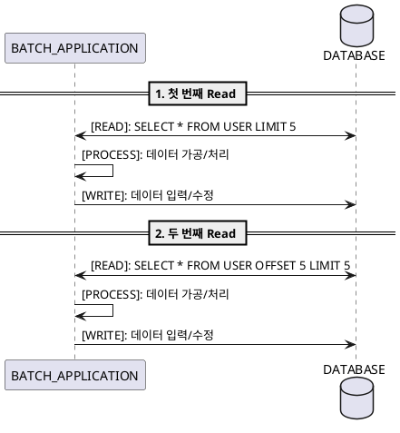

# 스프링 부트 배치 #2 - ItemReader

## 2.1 ItemReader
* 스프링 배치에서는 상황에 맞는 `ItemReader` 구현체를 제공
* `ItemReader`는 쓰레드 세이프하지 않기 때문에(Non-Thread-Safe) 쓰레드 간 경합이 발생하지 않도록 주의해야 한다.
  * 스프링 배치에서는 이를 보완하기 위해, `SynchronizedItemStreamReader` 구현체를 제공하며, 이를 생성할 수 있는 빌더 구현체인 `SynchronizedItemStreamReaderBuilder` 또한 제공한다.
* Flat-File, Message-Queue(AMQP), Database(RDBMS, Mongodb) 등의 ItemReader 구현체들이 존재하며, 스프링 배치에서 제공하고 있는 구현체들은 [링크](https://docs.spring.io/spring-batch/4.0.x/reference/html/appendix.html#listOfReadersAndWriters)를 통해 확인 가능하다.
* 스프링 배치에서 제공하지 않은, Custom ItemReader가 필요한 경우, ItemReader 인터페이스를 상속하게 ItemReader 구현체를 작성하면 된다.

## 2.2 ListItemReader
```java
    @Bean
    @StepScope
    public ListItemReader<User> itemReader() {
        List<User> oldUsers = userRepository.findByUpdatedDateBeforeAndStatusEquals(
            LocalDateTime.now().minusYears(1), UserStatus.AVTIVE
        );
        return new ListItemReader<>(oldUsers);
    }
```
* ListItemReader를 사용하면, 읽어온 리스트 데이터를 메모리에 올려두고 ItemReader.read()를 사용하여 하나씩 처리 작업을 수행한다. 
* 하지만, 전체 데이터를 메모리에 올려두고 사용하는 것은 비효율적이기 때문에, 이를 나눠서 처리 할 수 있는 `PagingItemReader` 구현체를 사용 할 수 있다.

## 2.3 Database Readers
데이터베이스를 기준으로 ItemReader의 구현체를 나눌 때, `Cursor Based ItemReader`과 `Paging Based ItemReader`으로 나눌 수 있다.

### Cursor Based ItemReader


* 관계형 데이터베이스에서 데이터를 Streaming 해오는 전통적인 방법으로 `ResultSet`을 통하여 커서를 유지하여 row 단위로 데이터를 가져오게 하는 방법을 많이 사용한다.
* Spring Batch에서 Cursor Based ItemReader 구현은 초기화 시 커서를 열고 모든 호출에 대해 커서를 한 행 앞으로 이동시킨다. 커서 이동은 read()를 호출하면서 일어난다.
* Spring Batch에서는 `JdbcCursorItemReader` 구현체를 제공하며 `DataSource`로부터 얻은 연결을 통하여 SQL 문을 실행하고 이를 `ResultSet`을 이용하여 커서 기반으로 데이터를 가져온다. `JdbcCursorItemReader`은 `JdbcCursorItemReaderBuilder`을 통하여 생성 할 수 있으며 예제 코드는 아래와 같다.

```java
    @Bean
    public JdbcCursorItemReader<CustomerCredit> itemReader() {
            return new JdbcCursorItemReaderBuilder<CustomerCredit>()
                            .dataSource(this.dataSource)
                            .name("creditReader")
                            .sql("select ID, NAME, CREDIT from CUSTOMER")
                            .rowMapper(new CustomerCreditRowMapper())
                            .build();

    }
```

* 이 밖에도 아래와 같은 ItemReader 구현체도 스프링 배치에서 제공하고 있다. 상황에 맞게 구현하면 된다.
  * [`HibernateCursorItemReader`](https://docs.spring.io/spring-batch/4.0.x/reference/html/readersAndWriters.html#HibernateCursorItemReader)
  * [`StoredProcedureItemReader`](https://docs.spring.io/spring-batch/4.0.x/reference/html/readersAndWriters.html#StoredProcedureItemReader)


### Paging Based ItemReader
* Cursor 기반의 ItemReader의 경우, 데이터베이스 커넥션을 지속적으로 독점으로 사용하여 처리가 완료되는 시점까지 커넥션을 놓아주지 않기 때문에, 경우에 따라 성능상에 영향을 줄 수 있다. 처리 해야 할 데이터가 크다면 Cursor 기반이 아닌 Pagination 기반의 구현을 사용하는 것이 유리하다. 
* Pagination 기반의 ItemReader의 구현체는 `JdbcPagingItemReader`, `JpaPagingItemReader`이 있다.

#### JdbcPagingItemReader
* `JdbcPagingItemReader`을 사용할 때, SQL 쿼리를 제공 `PagingQueryProvider`가 필요
* 데이터베이스마다 페이징을 처리하는 구문과 전략이 다르기 때문에 이를 지정해줘야 한다. 지원되는 각 데이터베이스 유형마다 다른 `PagingQueryProvider`를 사용해야합니다
* 또한 사용중인 데이터베이스를 자동으로 검색하고 적절한 `PagingQueryProvider` 구현을 결정하는 `SqlPagingQueryProviderFactoryBean`이 있다. `SqlPagingQueryProviderFactoryBean`은 select절, from절 및 sortKey 구문을 반드시 지정해야하며, where절은 필수가 아닌 옵션으로 설정 할 수 있다.

```java
@Bean
public JdbcPagingItemReader itemReader(DataSource dataSource) {
        Map<String, Object> parameterValues = new HashMap<>();
        parameterValues.put("status", "NEW");

        return new JdbcPagingItemReaderBuilder<CustomerCredit>()
                                           .name("creditReader")
                                           .dataSource(dataSource)
                                           .queryProvider(queryProvider())
                                           .parameterValues(parameterValues)
                                           .rowMapper(customerCreditMapper())
                                           .pageSize(1000)
                                           .build();
}

@Bean
public SqlPagingQueryProviderFactoryBean queryProvider() {
        SqlPagingQueryProviderFactoryBean provider = new SqlPagingQueryProviderFactoryBean();

        provider.setSelectClause("select id, name, credit");
        provider.setFromClause("from customer");
        provider.setWhereClause("where status=:status");
        provider.setSortKey("id");

        return provider;
}
```

#### JpaPagingItemReader

* `JpaPagingItemReader`를 통하여 지정한 페이지 사이즈만큼 데이터를 가져와서 처리 가능하다.
* 조회한 데이터는 JPA 영속성 컨텍스트상에서 `DETACH`상태이기 때문에, 영속성 컨텍스트의 관리 대상에서 벗어나게 된다.
* `JpaPagingItemReaderBuilder`를 통하여 생성 가능하며, `JpaPagingItemReader`를 직접 생성하는 것도 가능하다.
```java
    // JpaPagingItemReaderBuilder를 통한 생성
    @Bean
    public JpaPagingItemReader itemReader() {
            return new JpaPagingItemReaderBuilder<CustomerCredit>()
                                            .name("creditReader")
                                            .entityManagerFactory(entityManagerFactory())
                                            .queryString("select c from CustomerCredit c")
                                            .pageSize(1000)
                                            .build();
    }

    // 직접 생성
    @Bean(destroyMethod = "")
    @StepScope
    public JpaPagingItemReader<User> itemReader() {
        JpaPagingItemReader<User> jpaPagingItemReader = new JpaPagingItemReader<User>()
        jpaPagingItemReader.setQueryString(
            "select u from User as u where u.updatedDate < :updatedDate and u.status = :status"
        );
        HashMap<String, Object> map = new HashMap<>();
        map.put("updatedDate", LocalDateTime.now().minusYears(1));
        map.put("status", UserStatus.ACTIVE);
        jpaPagingItemReader.setParameterValues(map);
        jpaPagingItemReader.setEntityManagerFactory(entityManagerFactory);
        jpaPagingItemReader.setPageSize(CHUNK_SIZE);
        return jpaPagingItemReader;
    }
```
* `JpaPagingItemReader` 내부에서 `EntityManager`를 할당 받아서 사용한다. `EntityManagerFactory`를 통하여 생성한 `EntityManager`에서 지정한 크기대로 데이터를 가져오기 때문에 예를 들어 10개씩 `[읽기] -> [처리] -> [쓰기]`를 하는 Step이 있다고 했을 때, 처음 이후의 처리에 대해 데이터 건너뛰기가 발생 할 수 있다.



* 청크 단위로 데이터를 가져오도록 기본 구현이 되어 있기 때문에 5개의 아이템을 건너 뛰게 되는 상황이 생길 수 있다. 실제 두 번째 단계에서 올바른 데이터를 가져오기 위해서는 `OFFSET 5`을 빼놓고 SQL문을 질의해야 한다. 
* OFFSET 적용을 피하기 위해서는 아래와 같이 `JpaPagingItemReader`의 getPage를 오버라이드하여 매번 첫 번째 페이지만 참조할 수 있도록 변경하면 된다.

```java
JpaPagingItemReader<User> jpaPagingItemReader = new JpaPagingItemReader<User>() {
    @Override
    public int getPage() {
        return 0;
    }
};
```

#### RepositoryItemReader
* `PagingAndSortingRepository`룰 활용한 ItemReader 구현체
* `RepositoryItemReader`를 직접 생성하는 방법과 빌더 구현체인 `RepositoryItemReaderBuilder`를 통하여 `RepositoryItemReader` 인스턴스를 생성하는 방법이 있다.
* 구현 시, 주의해야 할 점은 Repository에서 Pageable 타입 혹은 하위 타입을 반환해야 하는점과 매소드 마지막 인자에 Pageable 인자를 포함해야 하는 점이다. 아래 예제 코드를 참고하자.
```java
public interface UserRepository extends JpaRepository<User, Long> {
    // 1. Pageable 타입을 반환해야 하며, 인자 마지막에 Pageable 타입의 인스턴스를 포함해야 함.
    Page<User> findByUpdatedDateBeforeAndStatusEquals(LocalDateTime localDateTime, UserStatus status, Pageable pageable);
}

@Bean
@StepScope
public RepositoryItemReader<User> itemReader() {
    return new RepositoryItemReaderBuilder()
        .repository(userRepository)
        .methodName("findByUpdatedDateBeforeAndStatusEquals")
        .pageSize(CHUNK_SIZE)
        .maxItemCount(CHUNK_SIZE)
        .arguments(Arrays.asList(LocalDateTime.now().minusYears(1), UserStatus.ACTIVE))
        .sorts(Collections.singletonMap("idx", Sort.Direction.ASC))
        .name("repositoryItemReader")
        .build();
}

```
* `RepositoryItemReader`도 마찬가지로 `JpaPagingItemReader`와 같이 지정해놓은 pageSize에 의거하여 건너뛰는 SQL 구문이 포함됨을 확인할 수 있었다. 이를 회피하기 위해서는 `doPageRead` 메소드를 오버라이드하여 첫 번째 페이지만 호출되도록 수정하면 된다. **아래 이미지의 주석 내용을 살펴보도록 하자**


> 실무에서는 JPA를 원활하게 사용하기 위해, querydsl 혹은 Specification API를 사용하게 되는데, 이를 사용하기 위해서는 결국 Custom ItemReader를 구현해서 사용하는 방법밖에 없는거 같다.


## 참고
* [처음 배우는 스프링 부트 2](https://book.naver.com/bookdb/book_detail.nhn?bid=14031681)
* [Spring Batch - Reference Documentation](https://docs.spring.io/spring-batch/4.1.x/reference/html/index.html)